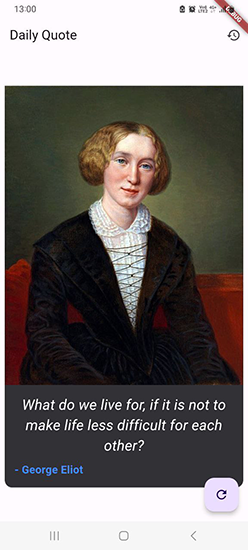

# simple_quote_app

The Simple Quote App is a mobile application built with Flutter that allows users to access inspirational daily quotes and share them with friends via social media or messaging platform
Simple Quote App

## Screenshot

  

## Features

- **Daily Inspirational Quote:** Fetches a random quote via a public API.
- **Save Favorites:** Allows users to save their favorite quotes.
- **Share Quotes:** Easily share quotes with others via messaging apps or social media.
- **Error Handling:** Displays meaningful error messages in case of connectivity or API failures.
- **Firebase Integration:** Stores and retrieves favorite quotes using Firebase Firestore.
- **User-Friendly Interface:** Designed with Material Design principles for a pleasant user experience.

## Folder Structure

```
lib/
├── screens/               # Folder for app screens
│   ├── home_screen.dart    # Main screen displaying the quote of the day
│   ├── history_screen.dart # Screen to view saved favorite quotes
│
├── models/                # Folder for data models
│   └── quote.dart          # Model for a quote
│
├── services/              # Folder for services and API interactions
│   ├── quote_api.dart      # Service to fetch quotes via API
│   ├── author_image_api.dart # Service for fetching author images (if applicable)
│
├── widgets/               # Folder for reusable widgets
│   └── quote_card.dart     # Widget for displaying a quote
│
└── main.dart              # Main entry point for the app
```

## Get Started

1. Clone the repository:
   ```bash
   git clone https://github.com/your-repo/simple-quote-app.git
   ```
2. Navigate to the project directory:
   ```bash
   cd simple-quote-app
   ```
3. Install dependencies:
   ```bash
   flutter pub get
   ```
4. Run the app:
   ```bash
   flutter run
   
## Contact

- 📧 Email: [konstantin.webdev.01@gmail.com](mailto:konstantin.webdev.01@gmail.com)
   
